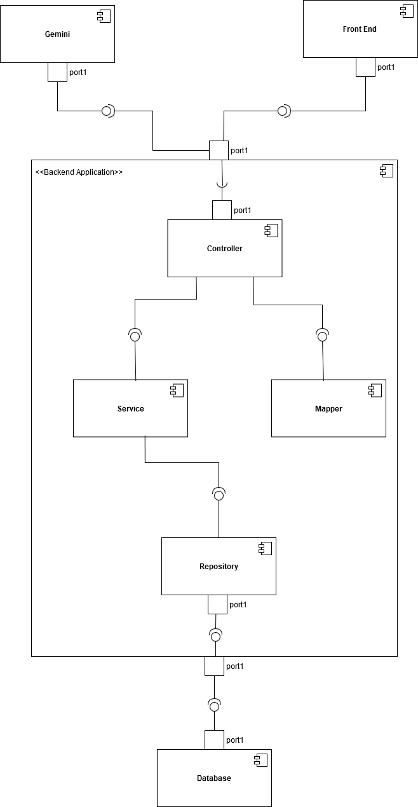

# Server

## Description
This is the backend part of the no-code application. It handles the requests coming from the frontend, stores the necessary data in the database, handles OCR, and performs extraction using Gemini.

## How to Run?
1. Install the appropriate version of Tesseract for your machine from: [Tesseract GitHub Repository](https://github.com/tesseract-ocr/tesseract).
2. Update the source code in the `DocumentService` class to point to the correct Tesseract folder on your machine.  
   - **Path:** `src/main/java/com/example/server/service/DocumentService`  
   - **Line:** 190
3. Get the API key (in JSON format) from the Google Cloud Console and store it on your computer.
4. Set an environment variable on your computer to point to the storage location of the downloaded key.
5. Add the Gemini project ID in `application.properties`.
6. Run the application alongside the frontend application to allow them to communicate with each other.

## High-Level Description of the Different Components
The application consists of the following components, which are graphically represented in the diagram below:

- **Front End:**  
  This component is responsible for user interactions. It includes all visual elements and their corresponding functionalities. User input is transmitted to the backend via a REST interface.

- **Controller:**  
  The controller manages interactions with external components. The application includes multiple controller classes, each responsible for a specific domain.  
  - For example, the `UserController` handles data related to users, while the `LLMController` manages communication with the Gemini API.

- **Mapper:**  
  The mapper facilitates data conversion between the frontend and internal entities. It ensures seamless transformation of data representations shared with the frontend into internal formats and vice versa.

- **Service:**  
  Service classes provide specialized functionality for distinct parts of the application.  
  - For instance, the `UserService` implements logic for creating, retrieving, and updating users, as well as generating and validating tokens.  
  - These classes operate on the internal entities and encapsulate core application logic.

- **Repository:**  
  Repositories are interfaces provided by Spring Boot to abstract database interactions.  
  - They support CRUD (Create, Read, Update, Delete) operations, enabling efficient data management.  
  - Each database table is associated with a dedicated repository to ensure modular and maintainable interactions with the data layer.
    
  

